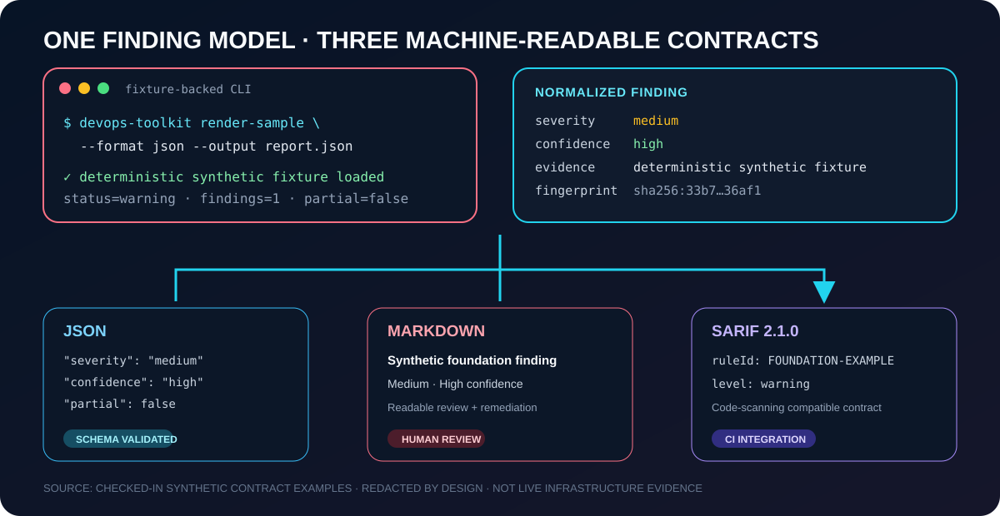

# DevOps Automation Toolkit

> An installable Python CLI that converts cloud and platform evidence into deterministic, redacted JSON, Markdown, and SARIF reports across 20 read-only-first tools.

The immutable `v1.0.0` tag and its unpublished draft are retained as release history. Version 1.0.1 is its first publishable successor; deterministic local and hosted checks do not replace target-environment validation for live providers or the native PowerShell collector.

[](https://github.com/goozcena-gnl/devops-automation-toolkit/actions/workflows/ci.yml)
[](https://github.com/goozcena-gnl/devops-automation-toolkit/actions/workflows/security.yml)
[](https://github.com/goozcena-gnl/devops-automation-toolkit/tags)
[](LICENSE)

<p align="center">
  
</p>

<p align="center"><sub><strong>Fixture-backed report evidence.</strong> The values shown are rendered from the checked-in synthetic <code>examples/reports/sample-report.*</code> contracts—no live cloud, customer, cluster, or credential data.</sub></p>

## Design principles

- Read-only or report-only behavior by default.
- No cloud deletion, IAM mutation, Terraform/OpenTofu apply, state unlock, Kubernetes upgrade, or workload patch is implemented.
- Credentials are obtained from existing CLI credential chains, OIDC, managed identities, or local configuration and are never persisted by the toolkit.
- Findings use a shared severity, confidence, evidence, fingerprint, and remediation model.
- Sensitive values are redacted before serialization.
- External calls have bounded timeouts and output limits.
- Fixture and snapshot modes support deterministic CI testing without live credentials.
- No command requires an LLM.

## Architecture overview

The installed CLI routes each command to a narrow collector/analyzer module. Shared core libraries enforce configuration precedence, safety policy, redaction, bounded subprocess execution, findings, fingerprints, and exit codes. Reporters serialize the same model to console, JSON, Markdown, or SARIF. JSON Schemas are stored in the repository and packaged in the wheel for offline validation. The Bash and PowerShell collectors emit the same report contract without importing the Python package.

See [`docs/architecture.md`](docs/architecture.md), [`docs/finding-model.md`](docs/finding-model.md), and the complete [`tool traceability matrix`](docs/validation-matrix.md).

## Installation

### With `uv`

```bash
uv tool install .
devops-toolkit version
```

For development, use `uv venv` and then `uv pip install -e '.[dev]'`.

### With `pipx`

```bash
pipx install .
devops-toolkit health
```

### With a virtual environment

```bash
python -m venv .venv
source .venv/bin/activate          # Linux/macOS
# .venv\Scripts\Activate.ps1      # Windows PowerShell
python -m pip install -e '.[dev]'
devops-toolkit version
```

### From a built wheel

```bash
python -m pip install devops_automation_toolkit-1.0.1-py3-none-any.whl
devops-toolkit health
```

The wheel contains the Python CLI and versioned JSON schemas. The native Bash and PowerShell collectors are distributed in the complete repository archive.

Checked-in reports under `examples/reports/` are synthetic or fixture-backed contract examples. They are not live assessments of a cloud account, cluster, workstation, or host.

## What to inspect first

These five tools provide a fast route through the toolkit's main collection,
analysis, safety, and reporting patterns. Follow them with the
[architecture interview walkthrough](docs/interview-walkthrough.md), then use
the [complete catalog](#tool-catalog) to inspect all 20 tools.

### 1. [Secret Sentinel](docs/tools/secret-sentinel.md)

- **Problem:** Detect credential-shaped material in files and optional Git history.
- **Input/evidence:** A readable directory, optional bounded commit history, and an optional fingerprint baseline; see the [fixture-backed report](examples/reports/phase3/secret-sentinel.json).
- **Safety:** History scanning is opt-in and bounded; binary/oversized content is skipped, and matched secret values are never serialized.
- **Output:** Console, JSON, Markdown, or SARIF findings with locations, detector identity, and non-reversible fingerprints.
- **Why inspect it:** It demonstrates bounded local collection, redaction, suppression, deterministic detection, and code-scanning output.

### 2. [IaC Repository Gate](docs/tools/iac-repo-gate.md)

- **Problem:** Apply one quality and security gate to Terraform/OpenTofu, YAML, Helm, and Ansible repositories.
- **Input/evidence:** Repository inventory plus optional locally installed validator results; see the [fixture-backed report](examples/reports/phase3/iac-repo-gate.json).
- **Safety:** Validator commands use argument vectors, timeouts, bounded sanitized output, and never run plan, apply, deployment, or remediation.
- **Output:** Normalized reports with built-in findings, validator availability, and explicit partial-evidence status for incomplete execution.
- **Why inspect it:** It shows deterministic analysis combined with safely orchestrated optional dependencies and honest degradation.

### 3. [Kubernetes Triage](docs/tools/kube-triage.md)

- **Problem:** Turn a scoped cluster-health snapshot into actionable incident findings.
- **Input/evidence:** Read-only `kubectl get ... -o json` collection for an explicit context and namespace; see the [fake-kubectl fixture report](examples/reports/phase3/kube-triage.json).
- **Safety:** Context/namespace allowlists and production acknowledgement constrain scope; Secret objects are never requested, and bundles are sanitized before atomic persistence.
- **Output:** Console, JSON, Markdown, or SARIF plus an optional sanitized evidence ZIP; failed collections remain visible as partial evidence.
- **Why inspect it:** It demonstrates guarded external collection, per-resource failure handling, redaction, analysis, and archive safety.

### 4. [GitHub Actions Guard](docs/tools/gha-guard.md)

- **Problem:** Find workflow security and reliability risks before Actions execution.
- **Input/evidence:** Local `.github/workflows/*.yml` and `.yaml` files only; see the [synthetic SARIF report](examples/reports/phase3/gha-guard.sarif).
- **Safety:** Static parsing performs no workflow execution, network resolution, or GitHub mutation.
- **Output:** Normalized console, JSON, Markdown, or SARIF findings with workflow paths and best-effort source lines.
- **Why inspect it:** It isolates deterministic policy analysis and source-aware reporting from collection and provider access.

### 5. [SLO Budget Calculator](docs/tools/slo-budget.md)

- **Problem:** Calculate SLI compliance, remaining error budget, and configured multi-window burn rates.
- **Input/evidence:** A YAML specification selecting CSV/JSON samples or a read-only Prometheus range query; see the [fixture-backed calculation report](examples/reports/phase5/slo-budget.json).
- **Safety:** Input validation and bounded HTTP timeouts apply; bearer tokens are read from named environment variables, and the command performs no remediation or mutation.
- **Output:** Shared-schema reports that distinguish no data from zero failures and expose compliance, budget consumption, and burn calculations.
- **Why inspect it:** It demonstrates deterministic numerical analysis across offline fixtures and an explicitly scoped live read-only adapter.

## Tool catalog

| Rank | Tool | Entry point | Language | Primary use |
|---:|---|---|---|---|
| 1 | Secret Sentinel | `devops-toolkit secret-sentinel` | Python | Files and bounded Git-history secret detection |
| 2 | Workstation Doctor | `scripts/workstation/devops-workstation-audit.ps1` | PowerShell | Windows, WSL, Git, SSH, Docker, cloud CLI, and kubeconfig readiness |
| 3 | IaC Repository Gate | `devops-toolkit iac-repo-gate` | Python | Terraform/OpenTofu, YAML, Helm, and Ansible quality gate |
| 4 | GitHub Actions Guard | `devops-toolkit gha-guard` | Python | Workflow security and reliability audit |
| 5 | Kubernetes Triage | `devops-toolkit kube-triage` | Python | Sanitized Kubernetes incident evidence |
| 6 | Plan Risk Analyzer | `devops-toolkit plan-risk` | Python | Terraform/OpenTofu plan JSON risk analysis |
| 7 | Linux Incident Snapshot | `scripts/linux/linux-triage.sh` | Bash | Bounded Linux host diagnostics and support bundle |
| 8 | Repository Baseline | `devops-toolkit repo-baseline` | Python | GitHub governance and protection baseline |
| 9 | Kubeconfig Hygiene | `devops-toolkit kubeconfig-hygiene` | Python | Local Kubernetes credential and TLS hygiene |
| 10 | TLS Auditor | `devops-toolkit tls-audit` | Python | Trust, hostname, protocol, and expiry checks |
| 11 | Container Image Gate | `devops-toolkit image-gate` | Python | Trivy normalization, SBOM, and optional signature policy |
| 12 | CI Evidence Collector | `devops-toolkit ci-evidence` | Python | Sanitized CI failure evidence and signatures |
| 13 | Prometheus Auditor | `devops-toolkit prom-audit` | Python | Targets, rules, alerts, and promtool checks |
| 14 | SLO Budget Calculator | `devops-toolkit slo-budget` | Python | SLI compliance, error budget, and burn rates |
| 15 | Kubernetes Rightsizing | `devops-toolkit kube-rightsize` | Python | Requests/limits analysis against current usage |
| 16 | Cloud IAM Auditor | `devops-toolkit cloud-iam-audit` | Python | Azure and AWS identity exposure |
| 17 | Cloud Waste Inventory | `devops-toolkit cloud-waste` | Python | Evidence-based unused-resource inventory |
| 18 | Cloud Budget Guard | `devops-toolkit budget-guard` | Python | Budgets, alerts, forecasts, and cost anomalies |
| 19 | IaC Drift Guard | `devops-toolkit iac-drift-guard` | Python | Refresh-only Terraform/OpenTofu drift detection |
| 20 | Kubernetes Upgrade Readiness | `devops-toolkit kube-upgrade-readiness` | Python | Version skew, removed APIs, drain and add-on readiness |

Detailed permissions, examples, limitations, and failure modes are in [`docs/script-catalog.md`](docs/script-catalog.md) and [`docs/tools/`](docs/tools/).

## Typical commands

```bash
# Audit a repository without modifying it
devops-toolkit secret-sentinel . --format sarif --output secrets.sarif
devops-toolkit iac-repo-gate . --format json --output iac-report.json
devops-toolkit gha-guard . --format sarif --output workflows.sarif

# Analyze exported evidence
devops-toolkit plan-risk tfplan.json --format markdown --output plan-risk.md
devops-toolkit repo-baseline --snapshot github-baseline.json
devops-toolkit cloud-waste --provider aws --snapshot aws-inventory.json

# Use explicitly scoped live read-only collection
devops-toolkit kube-triage --context staging --namespace payments
devops-toolkit prom-audit --url https://prometheus.example.com
devops-toolkit kube-upgrade-readiness --target-version 1.33.0 --context staging
```

Run `devops-toolkit COMMAND --help` for each complete interface.

## Reports and exit codes

Python analyzers support console, JSON, Markdown, and SARIF where the format is meaningful. Native host collectors emit schema-valid JSON and optional sanitized archives.

| Code | Meaning |
|---:|---|
| 0 | Successful execution with no configured threshold violation |
| 1 | Findings exceeded the configured threshold |
| 2 | Invalid arguments, input, or configuration |
| 3 | Required dependency unavailable |
| 4 | Authentication or authorization failure |
| 5 | Partial collection or incomplete evidence |
| 6 | Unexpected internal failure |
| 7 | Safety policy blocked execution |

## Development and validation

```bash
make validate
make build
python tools/check_docs.py
```

`make validate` runs formatting and lint checks, strict type checking, unit and contract tests with coverage, isolated subprocess-heavy integration tests without inherited coverage, Bandit, configuration and report contracts, native syntax checks, documentation checks, and repository self-audits.

See:

- [`PHASE7_VALIDATION.md`](PHASE7_VALIDATION.md) for the final release evidence;
- [`docs/validation-matrix.md`](docs/validation-matrix.md) for 20-tool implementation, test, documentation, and example traceability;
- [`docs/testing.md`](docs/testing.md) for the test strategy;
- [`docs/compatibility.md`](docs/compatibility.md) for supported and unproven environments;
- [`SECURITY.md`](SECURITY.md) for vulnerability reporting and security invariants;
- [`docs/release-process.md`](docs/release-process.md) for the tag and release workflow.

## Validation boundary

The deterministic analysis engines, schemas, package installation, fixtures, fake CLI integrations, local Linux collector, and local TLS behavior are tested. Live Azure, AWS, private GitHub, enterprise Prometheus, production Terraform/OpenTofu state, production Kubernetes clusters, and the native PowerShell collector require validation in the target environment before operational adoption.

A clean static audit or fixture-backed result is not proof that a production environment is safe.

Contributions follow [`CONTRIBUTING.md`](CONTRIBUTING.md). Release construction and approval gates are documented in [`docs/release-process.md`](docs/release-process.md), and security reports follow [`SECURITY.md`](SECURITY.md).
